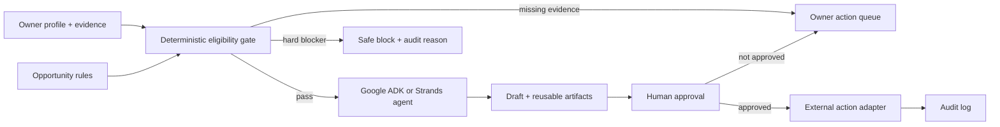

# PrizePilot Agent

PrizePilot turns a portfolio and a reusable evidence library into a safe,
auditable application queue. It handles repetitive preparation work, blocks
ineligible opportunities, and surfaces only decisions that genuinely require
the owner.

Built from scratch during the August 2026 submission periods for:

- Google **All Things Agentic Hackathon** — Gemini 3.5, Google ADK and Google Cloud.
- AWS **Agents for Humans Hackathon** — Strands Agents SDK, with optional AgentCore deployment.

## Why it matters

Competition and grant forms repeat the same work, but automating them carelessly
creates a worse problem: invented credentials, unsupported impact claims, or a
submission made without the owner understanding what was sent. PrizePilot makes
autonomy useful by putting deterministic eligibility gates and an approval log
in front of every external action.

## Working flow

1. Normalize an opportunity into hard gates, evidence requirements and stack requirements.
2. Evaluate the owner profile without converting unknown facts into positive claims.
3. Reuse only documented answers and artifacts.
4. Produce a short queue: ready for review, evidence needed, or safely blocked.
5. Require an approval record before any external transmission or final submission.

The included demo runs deterministically without cloud credentials. Provider
adapters are isolated so the same safety engine can be demonstrated through
Google ADK or Strands Agents.

## Run locally

```bash
python -m venv .venv
source .venv/bin/activate
pip install -r requirements.txt
uvicorn app.api:app --reload
```

Open `http://127.0.0.1:8000`.

For a zero-dependency local demo before installing the cloud SDKs:

```bash
python -m app.dev_server
```

## Test the safety gate

```bash
python -m unittest discover -s tests -v
```

## Google build

Set `GOOGLE_API_KEY` (or configure Vertex AI credentials), optionally set
`GEMINI_MODEL`, and create the agent with:

```python
from app.providers.google_adk import create_google_agent

agent = create_google_agent()
```

The included `Dockerfile` and `cloudbuild.yaml` target Cloud Run. Production
state can be stored in Firestore; secrets must remain in Secret Manager and are
never committed.

## AWS build

Configure normal AWS credentials and create the Strands agent with:

```python
from app.providers.strands_agent import create_strands_agent

agent = create_strands_agent()
```

The deterministic gate remains authoritative even when an LLM suggests an
action. AgentCore deployment is optional and will be documented separately.

## Architecture



## Integrity notes

- This repository does not claim measured time savings, win rates or customer traction.
- GreenRoute and other earlier projects supplied domain insight only; this codebase is new.
- No `.env`, API key or cloud credential belongs in version control.
- Devpost registration, cloud deployment and final submission remain owner-approved actions.
